# Writing User Modules on macOS
#setup #macos #xcode #tutorial

*Based on the original document by Benoit Bouchez (iModularSynth)*  
*Version 2.0 — November 2023*

---

## Introduction

This tutorial explains how to create a user module for Usine Hollyhock "from scratch" using **Xcode** on macOS. It covers project setup and build configuration — for understanding how modules work internally, refer to the [[sdk/module-architecture|Module Architecture]] and [[sdk/user-module-base|UserModuleBase]] pages.

This tutorial was written using Usine Hollyhock SDK 6+ and Xcode 14.

## Prerequisites

- **Xcode** (free from the Mac App Store)
- **Usine Hollyhock** installed on your system
- The **Usine SDK** downloaded and extracted

## SDK Folder Structure

After extracting the SDK:

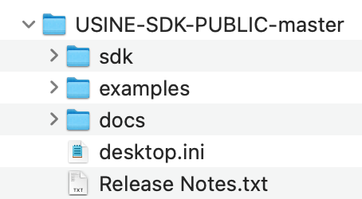

> **Note:** Usine user modules on macOS are dynamic libraries (dylib) with a custom file extension.

---

## Step 1: Create the Project

1. Open Xcode and click **Create a new Xcode project**
2. Select the **macOS** tab, then under **Framework & Library**, select **Library**

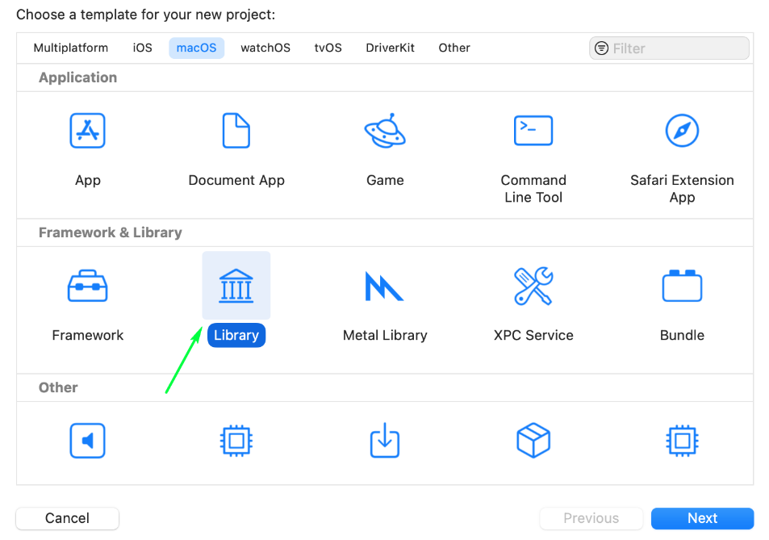

3. Configure your project:
   - **Product Name:** `MyModule`
   - **Framework:** `STL (C++ Library)`
   - **Type:** **Dynamic**

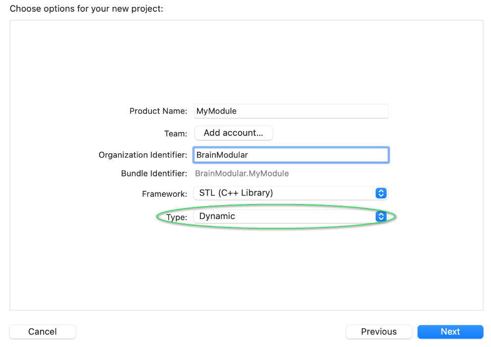

---

## Step 2: Add SDK Files

1. In the **Project Navigator**, right-click your project and select **New Group**, name it `SDK`

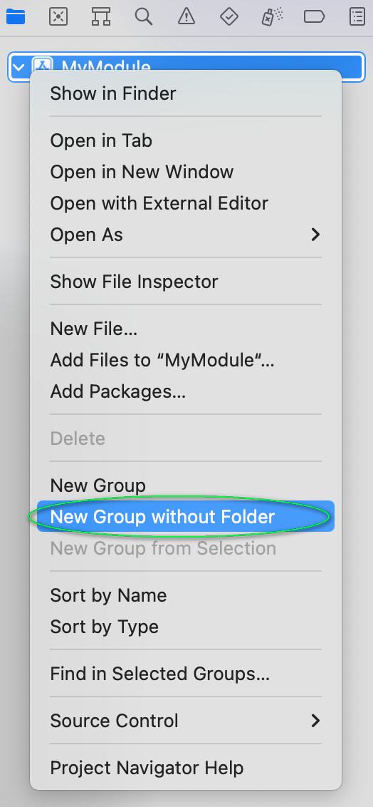

2. Right-click the `SDK` group and select **Add Files to 'MyModule'...**

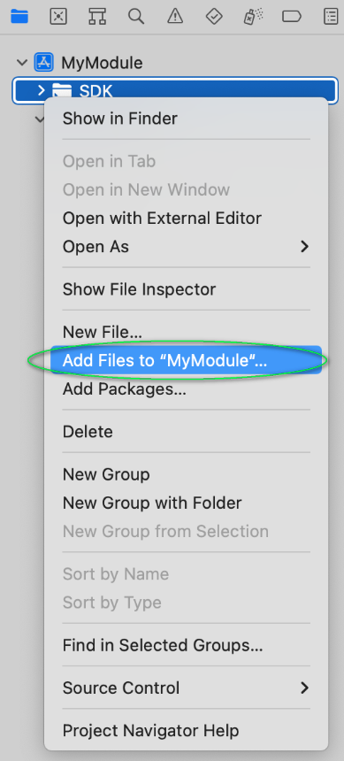

3. Navigate to the SDK's `sdk/` subfolder, select **all files** (Shift+click) and click **Add**

Your project structure should look like:

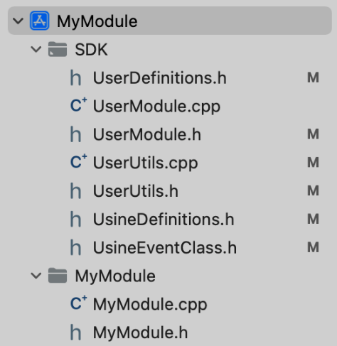

```
MyModule
├── SDK
│   ├── UserDefinitions.h
│   ├── UserModule.cpp
│   ├── UserModule.h
│   ├── UsineDefinitions.h
│   ├── UsineEventClass.h
│   ├── UsineFunctions.h
│   └── UserUtils.h
└── MyModule
    ├── MyModule.cpp
    └── MyModule.h
```

---

## Step 3: Configure Build Settings

### Target: General

Click your project in the Navigator, then select your target under **TARGETS**. In the **General** tab, set **Deployment Target** to **10.13**:

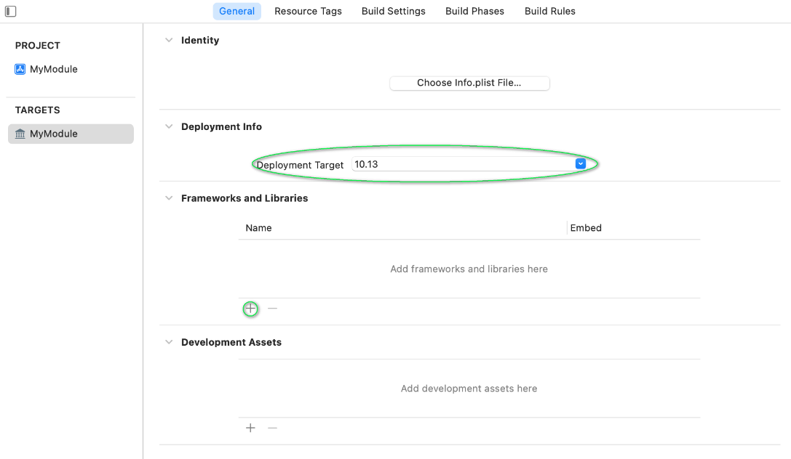

### Target: Build Settings

Select **All** at the top to show all settings, then configure:

**Build Active Architecture Only** — set to **No**:


**Executable Extension** — set based on your target architecture (see table below):


**Executable Prefix** — clear the line to remove the default `lib`:


### File Extensions by Architecture

| Target | Extension |
|--------|-----------|
| **Universal** (recommended) | `usr-macos64uni` |
| Intel only | `usr-osx64` |
| Apple Silicon only | `usr-osxarm64` |

### User-Defined Setting: VALID_ARCHS

1. Click the **+** button at the top of Build Settings
2. Select **Add User-Defined Setting**

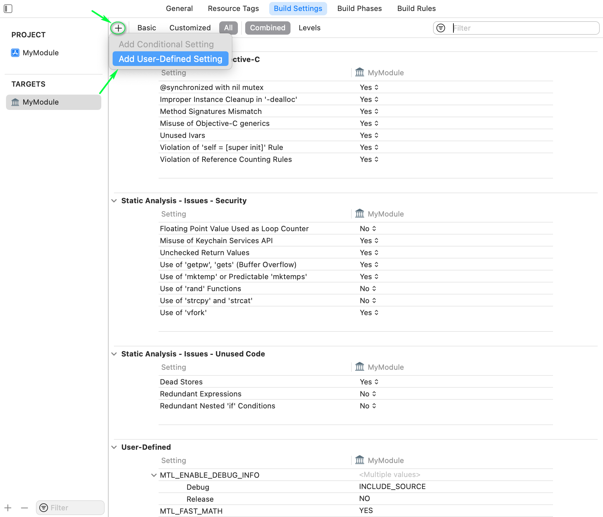

3. Set name to `VALID_ARCHS` and value based on target:


| Target | VALID_ARCHS |
|--------|-------------|
| **Universal** | `x86_64 arm64` |
| Intel only | `x86_64` |
| Apple Silicon only | `arm64` |

---

## Step 4: Copy Files Phase (Output)

To automatically copy the built binary to an accessible location:

1. Go to the **Build Phases** tab
2. Click **+** at the top and select **New Copy Files Phase**

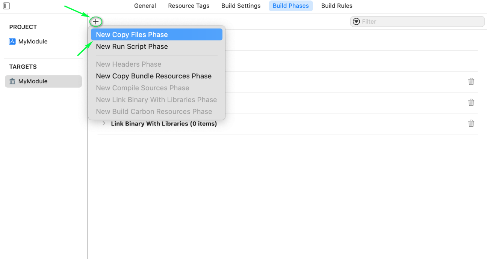

3. Click **+** at the bottom of the new section and select your product

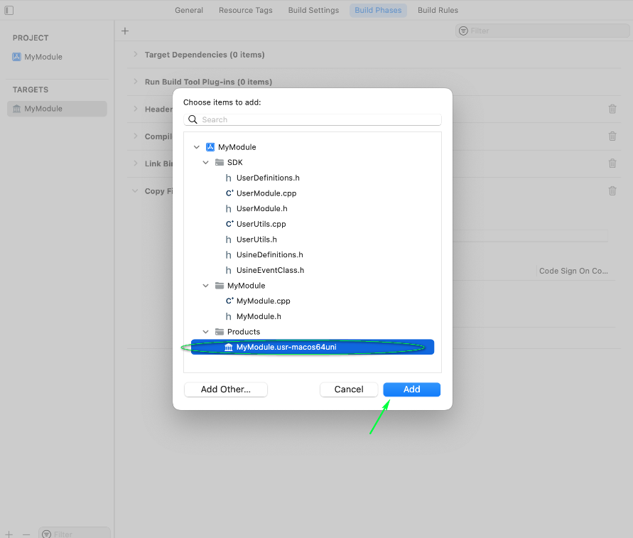

4. Set **Destination** to **Absolute Path** and enter the output path (e.g., `$(SRCROOT)/bin`)

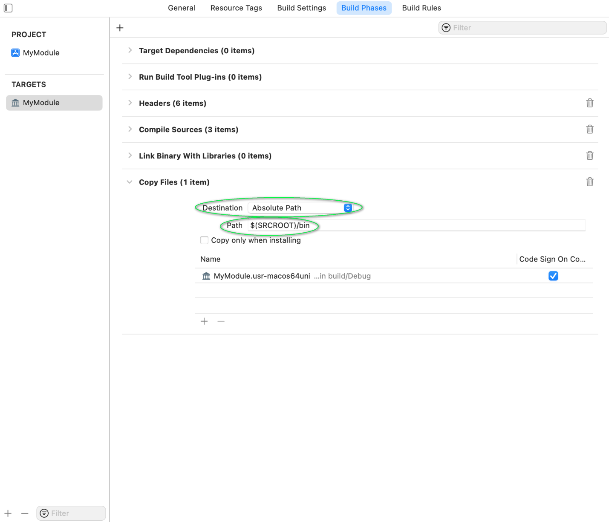

---

## Step 5: Debugging

To debug your module in Xcode:

1. Go to **Product > Scheme > Edit Scheme...**
2. Click the **Run** tab, then set the **Executable** to the Usine application

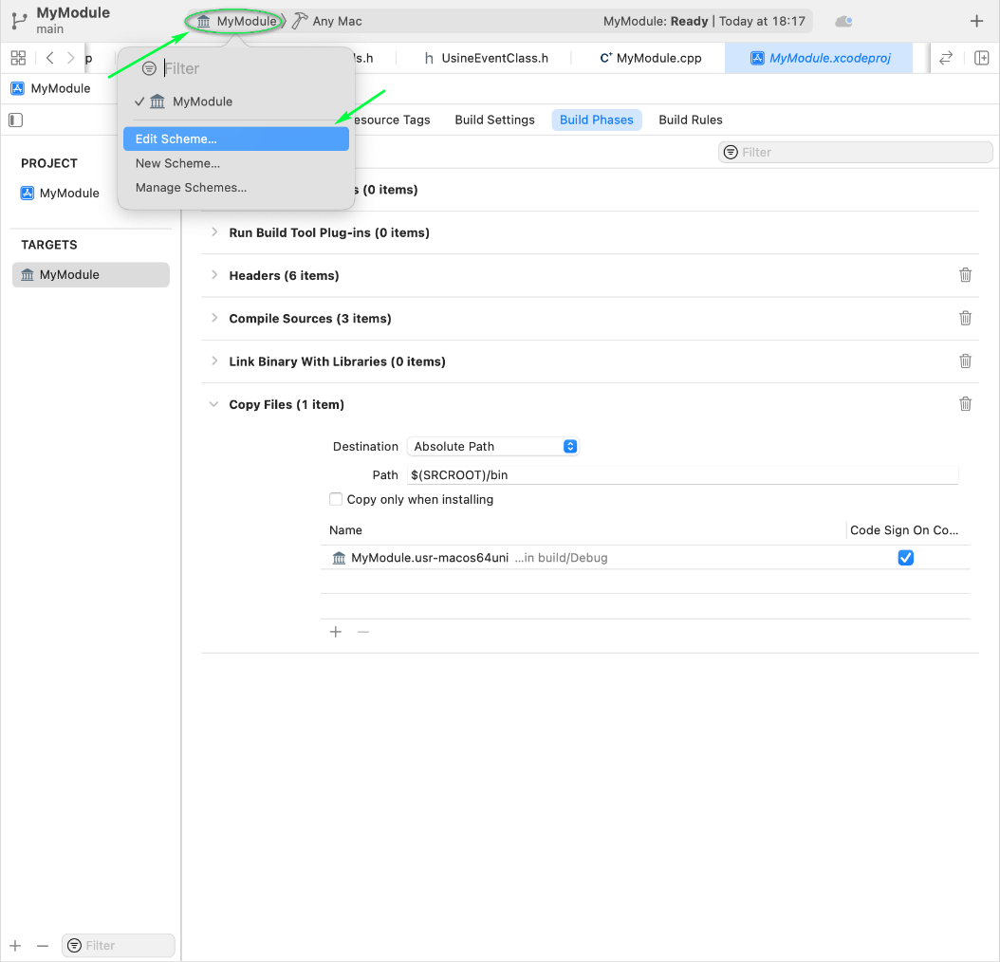

Now when you click **Run** (Cmd+R), Xcode will launch Usine with your debugger attached. You can use breakpoints, step-by-step execution, and all standard debugging features.

---

## Other Targets (Architecture-Specific)

Universal binaries are recommended, but if your project uses external libraries that don't support universal builds, you may need architecture-specific targets.

### Intel Only

Set the extension to `usr-osx64`:


Set `VALID_ARCHS` to `x86_64`:


### Apple Silicon Only

Set the extension to `usr-osxarm64`:


Set `VALID_ARCHS` to `arm64`:


---

## Build Settings Summary

| Setting | Universal | Intel | Apple Silicon |
|---------|-----------|-------|---------------|
| Extension | `usr-macos64uni` | `usr-osx64` | `usr-osxarm64` |
| VALID_ARCHS | `x86_64 arm64` | `x86_64` | `arm64` |
| Build Active Arch Only | No | No | No |
| Executable Prefix | (empty) | (empty) | (empty) |
| Deployment Target | 10.13 | 10.13 | 10.13 |
| Library Type | Dynamic | Dynamic | Dynamic |

---

## Next Steps

- Write your module code — see [[getting-started|Getting Started]] for a minimal example
- Study the [[README|Examples]] for working demonstrations
- Read [[sdk/module-architecture|Module Architecture]] for the full lifecycle
- Check [[sdk/user-module-base|UserModuleBase]] for all available callbacks

---

## Related Pages

- [[docs/writing-user-modules-windows|Writing User Modules on Windows]]
- [[getting-started|Getting Started]]
- [[sdk/module-architecture|Module Architecture]]
