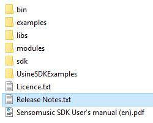
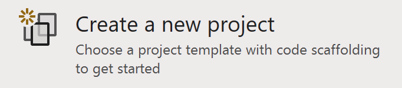
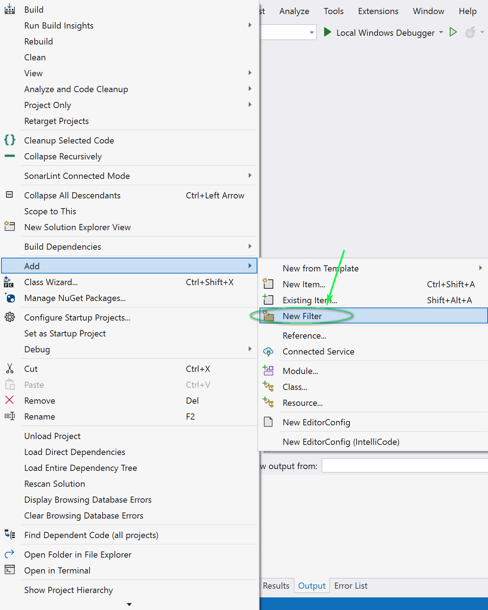
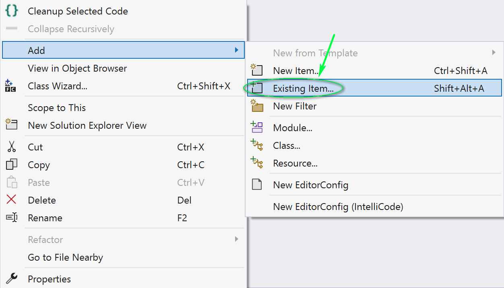
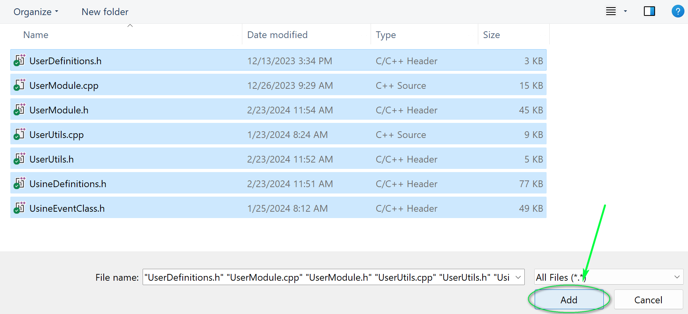
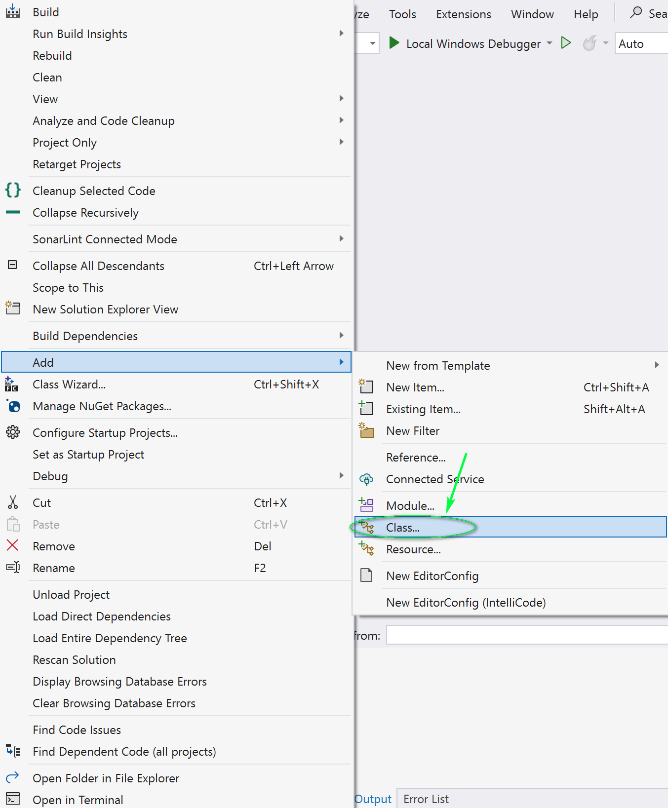
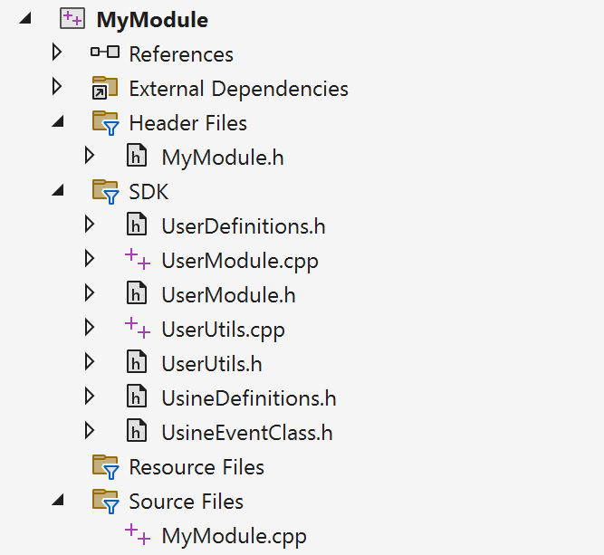
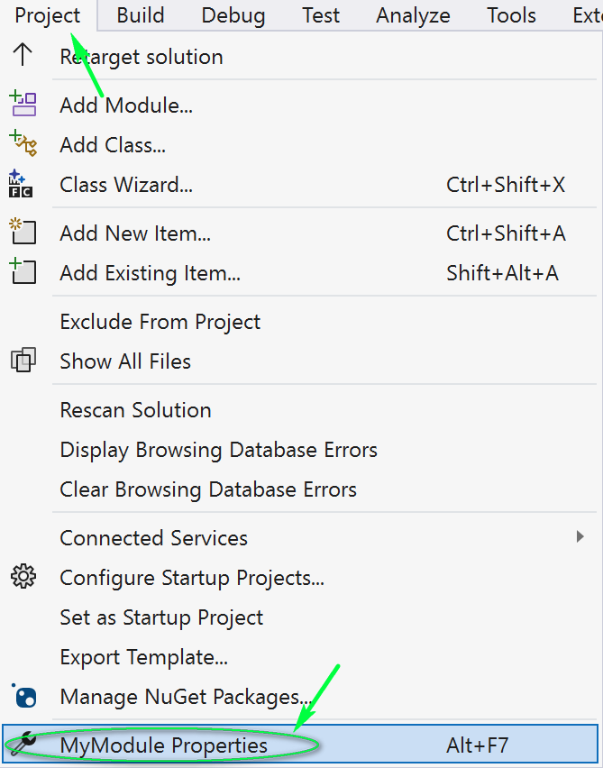
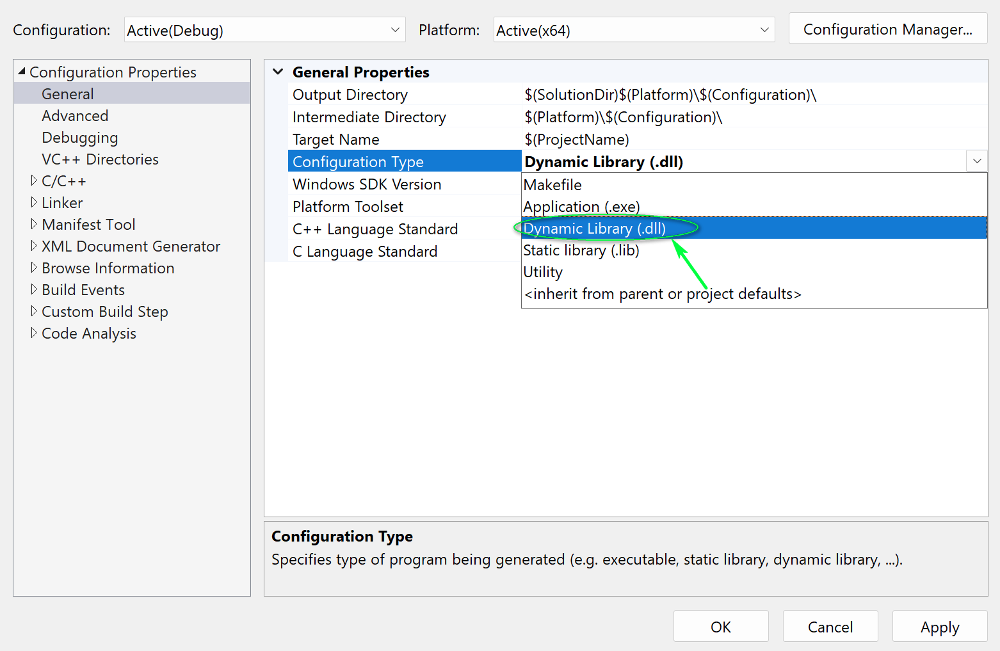
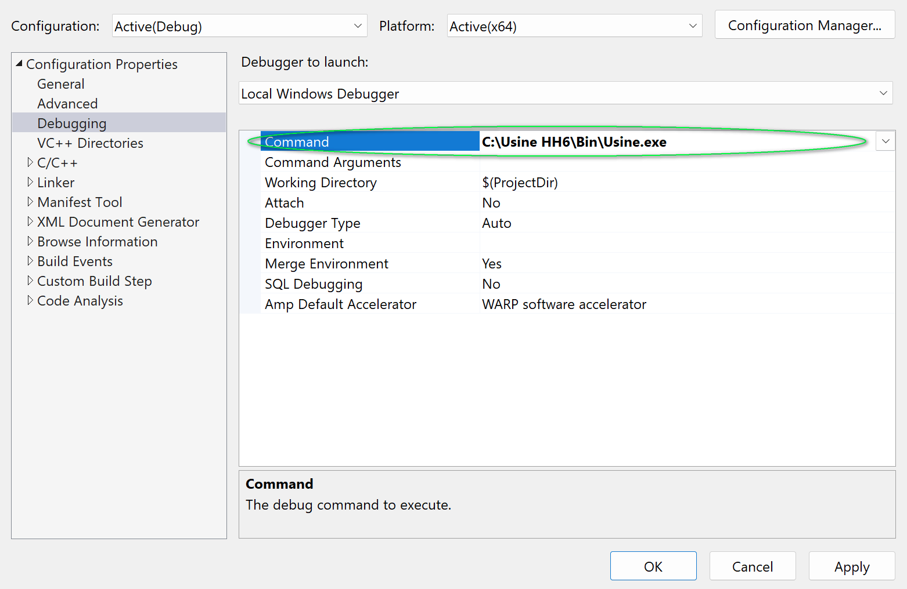

# Writing User Modules on Windows
#setup #windows #visual-studio #tutorial

*Based on the original document by Benoit Bouchez (iModularSynth)*  
*Version 2.0 — February 2024*

---

## Introduction

This tutorial explains how to create a user module for Usine Hollyhock "from scratch" using **Visual C++** on Windows. It covers project setup and build configuration — for understanding how modules work internally, refer to the [[sdk/module-architecture|Module Architecture]] and [[sdk/user-module-base|UserModuleBase]] pages.

This guide was written for Usine Hollyhock 6+ and Visual Studio Community 2022. Other Visual Studio versions may look slightly different but the steps remain the same.

## Prerequisites

- **Visual Studio 2022** (Community, Professional, or Enterprise) with C++ workload installed
- **Usine Hollyhock** installed on your system
- The **Usine SDK** downloaded and extracted to your hard disk

## SDK Folder Structure

After extracting the SDK, you should see the following structure:



> **Note:** Technically, Usine user modules are standard DLLs with specific properties and a custom file extension.

---

## Step 1: Create the Project

1. Open Visual Studio
2. Select **File > Create a new project**



3. Choose **Empty Project** with the **C++** tag and enter your project name (e.g., `MyModule`)


---

## Step 2: Add SDK Files

First, add the SDK files to your project:

1. In the **Solution Explorer**, right-click your solution name and navigate to **Add > New Filter**



2. Rename the filter to `SDK`, then right-click it and select **Add > Existing Item...**



3. Navigate to the SDK's `sdk/` subfolder, select **all files** and click **Add**



The SDK files to include are:
- `UserDefinitions.h`
- `UserModule.cpp`
- `UserModule.h`
- `UsineDefinitions.h`
- `UsineEventClass.h`
- `UsineFunctions.h`
- `UserUtils.h`

---

## Step 3: Add Your Module Class

1. Right-click your project in the Solution Explorer and navigate to **Add > Class...**



2. Enter the class name (e.g., `MyModule`) and click **OK**

Your project structure should now look like this:



```
MyModule (Solution)
├── Header Files
│   └── MyModule.h
├── SDK
│   ├── UserDefinitions.h
│   ├── UserModule.cpp
│   ├── UserModule.h
│   ├── UsineDefinitions.h
│   ├── UsineEventClass.h
│   ├── UsineFunctions.h
│   └── UserUtils.h
└── Source Files
    └── MyModule.cpp
```

---

## Step 4: Configure Build Settings

Open **Project > Properties** (or press Alt+F7).



The following settings must be configured for each build configuration (Debug/Release).

### General

Set the **Configuration Type** to **Dynamic Library (.dll)**:



| Setting | Value |
|---------|-------|
| **Configuration Type** | **Dynamic Library (.dll)** |
| C++ Language Standard | C++17 or later (recommended) |

### Advanced

Set the **Target File Extension** and **Character Set**:


| Setting | Value |
|---------|-------|
| **Target File Extension** | **`.usr-win64`** |
| **Character Set** | **Use Multi-Byte Character Set** |

### C/C++ > General

Add the path to the SDK folder:


| Setting | Value |
|---------|-------|
| **Additional Include Directories** | Path to the SDK `sdk/` folder (e.g., `..\..\sdk`) |

> **Important:** The path can be absolute or relative to your solution file. Relative paths are recommended for portability.

---

## Step 5: Post-Build Event (Optional)

To automatically copy the built module to Usine's user modules folder, add a post-build event:

1. Go to **Build Events > Post-Build Event**
2. Set the **Command Line** to:
   ```
   copy "$(TargetPath)" "C:\path\to\Usine\User Modules\"
   ```

---

## Step 6: Debugging

To debug your module directly in Visual Studio:

1. Go to **Project > Properties > Debugging**
2. Set **Command** to the Usine executable path



> **Important:** Use the executable in the `Bin` folder, not the one at the root of Usine's installation (the root exe is a launcher).

3. Click **Run** (F5) — Visual Studio will launch Usine with your debugger attached
4. You can set breakpoints, step through code, inspect variables, etc.

---

## Build Settings Summary

| Setting | Value |
|---------|-------|
| Configuration Type | Dynamic Library (.dll) |
| Target File Extension | `.usr-win64` |
| Character Set | Multi-Byte Character Set |
| Additional Include Directories | `..\..\sdk` (relative) |
| C++ Standard | C++17 |
| Debug Command | `C:\Usine HH7\Bin\Usine.exe` |

---

## Next Steps

- Write your module code — see [[getting-started|Getting Started]] for a minimal example
- Study the [[README|Examples]] for working demonstrations
- Read [[sdk/module-architecture|Module Architecture]] for the full lifecycle
- Check [[sdk/user-module-base|UserModuleBase]] for all available callbacks

---

## Related Pages

- [[docs/writing-user-modules-macos|Writing User Modules on macOS]]
- [[getting-started|Getting Started]]
- [[sdk/module-architecture|Module Architecture]]
