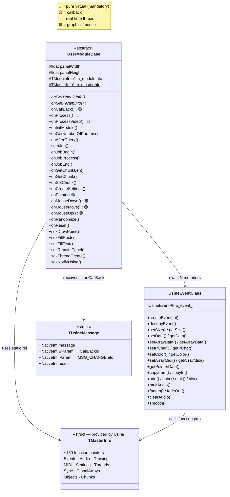
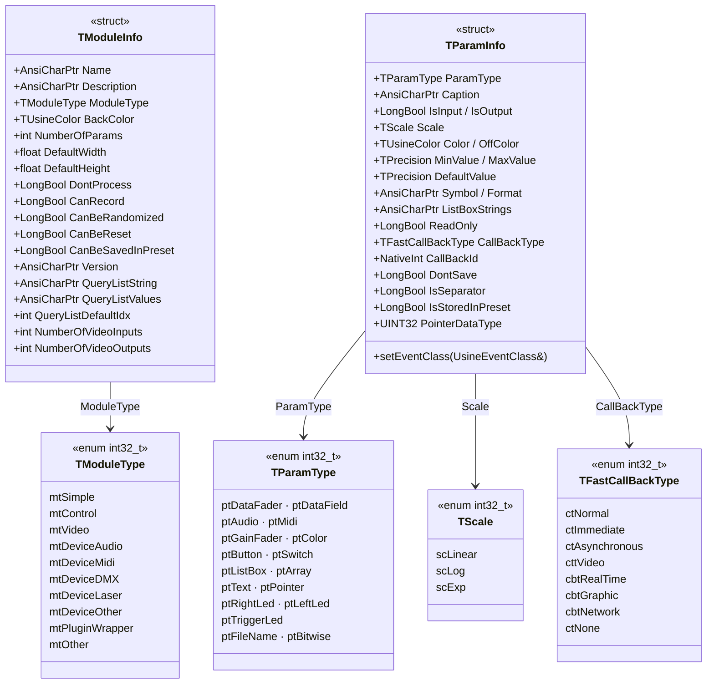
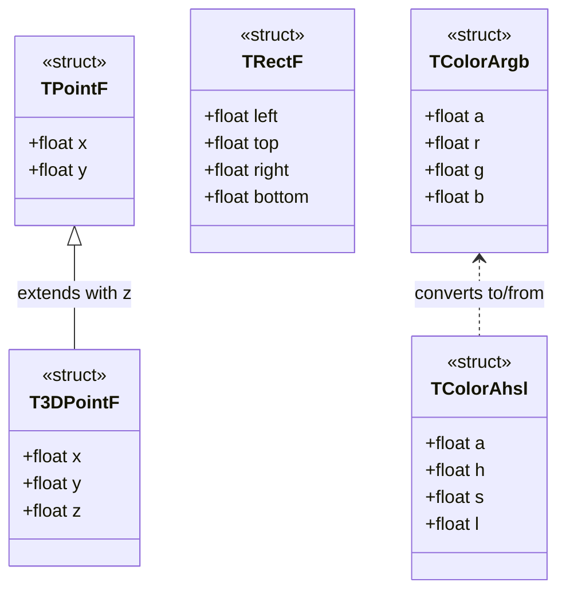
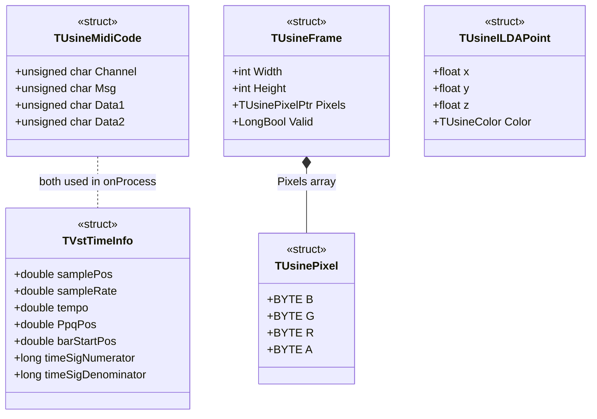
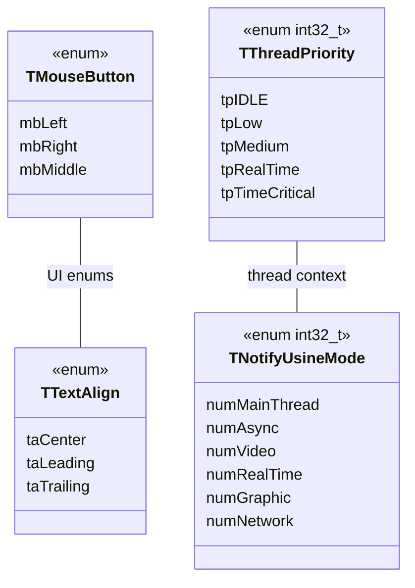
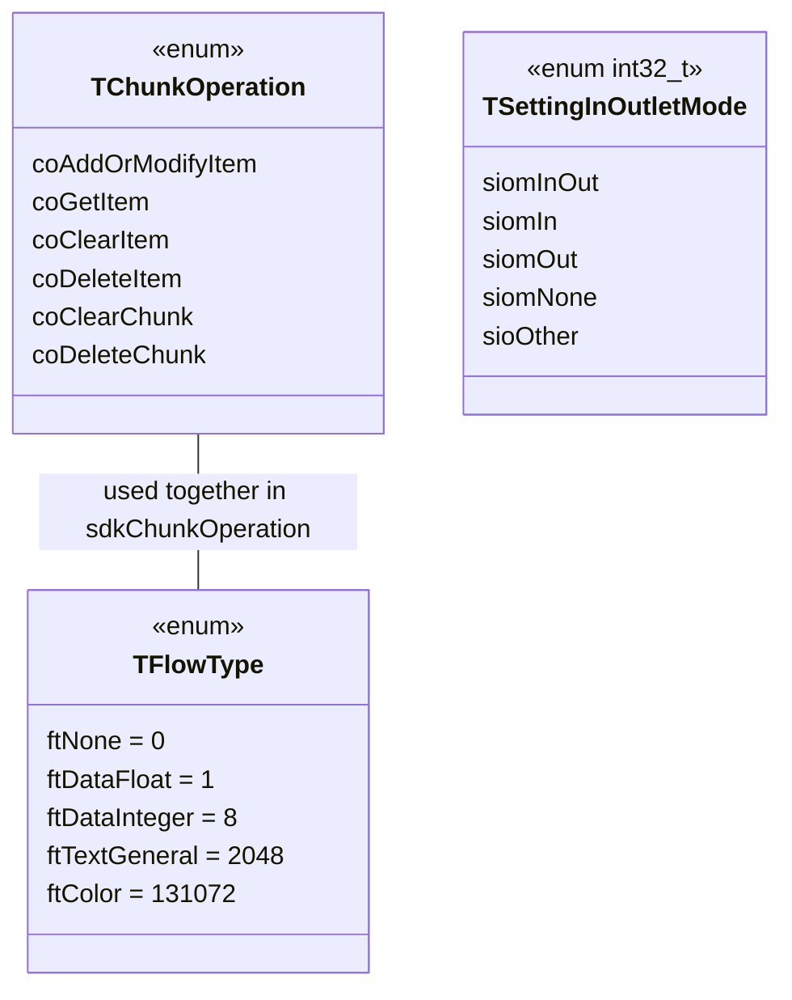
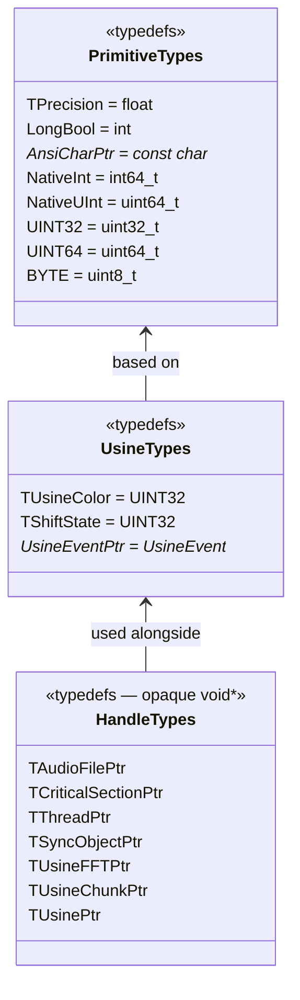
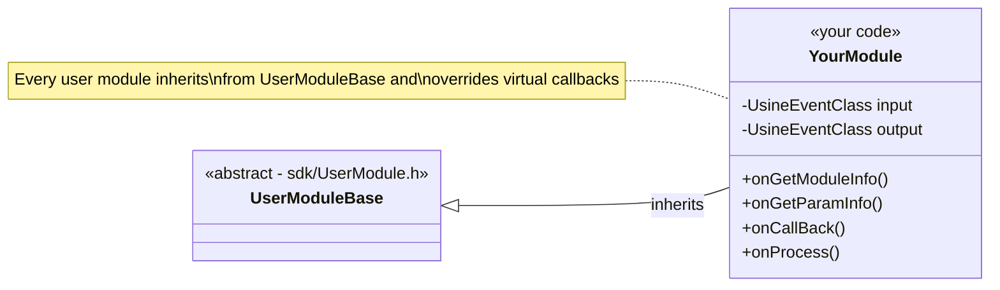
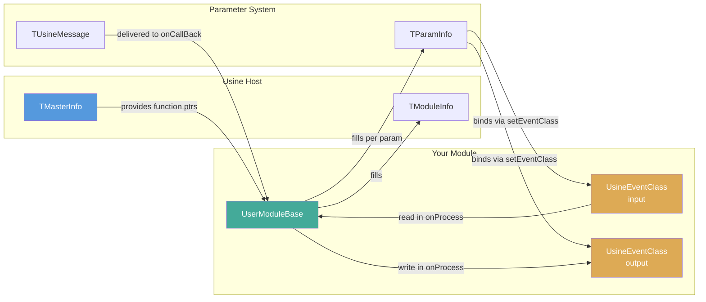

# SDK Class Diagram

#sdk #architecture #reference #class #types #diagram

Complete class diagram of the Usine Hollyhock SDK showing all classes, structures, enums, and their relationships.

## 1. Core Classes & Relationships

The two main classes and the structures they interact with directly.

---

## 2. Module Description Structs

Structures used to describe a module and its parameters to Usine.

---

## 3. Data Structures — Geometry & Color

## 4. Data Structures — MIDI, Video & Time

---

## 5. Enums — Threading & Notifications

## 6. Enums — Chunks & Settings

## 7. Type Aliases

## File Mapping

| SDK File | Contains |
|----------|----------|
| `UserDefinitions.h` | Master include — pulls in all other headers |
| `UsineDefinitions.h` | All types, structs, enums, constants, `TMasterInfo`, `TModuleInfo`, `TParamInfo` |
| `UserModule.h` | `UserModuleBase` class definition, 3 mandatory global functions |
| `UserModule.cpp` | `UserModuleBase` implementation, DLL export bridge functions |
| `UsineEventClass.h` | `UsineEventClass` wrapper class |
| `UsineFunctions.h` | Inline SDK utility functions (wrappers around `TMasterInfo` pointers) |
| `UserUtils.h` | Color conversion, geometry, numeric helper functions |

## Inheritance Pattern

## Data Flow Relationships

## Related Pages

- [[sdk/module-architecture|Module Architecture]] — Lifecycle and data flow
- [[sdk/user-module-base|UserModuleBase Class]] — Complete callback reference
- [[sdk/usine-event-class|UsineEventClass]] — Event manipulation API
- [[sdk/data-types|Data Types & Constants]] — All types and enums in detail
- [[sdk/sdk-functions|SDK Functions]] — Global utility functions
- [[sdk/utility-functions|Utility Functions]] — Color, geometry, math helpers
- [[getting-started|Getting Started]] — Your first module
