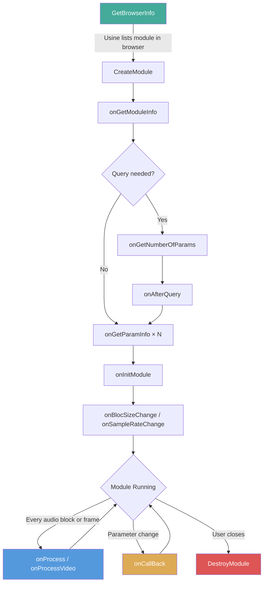
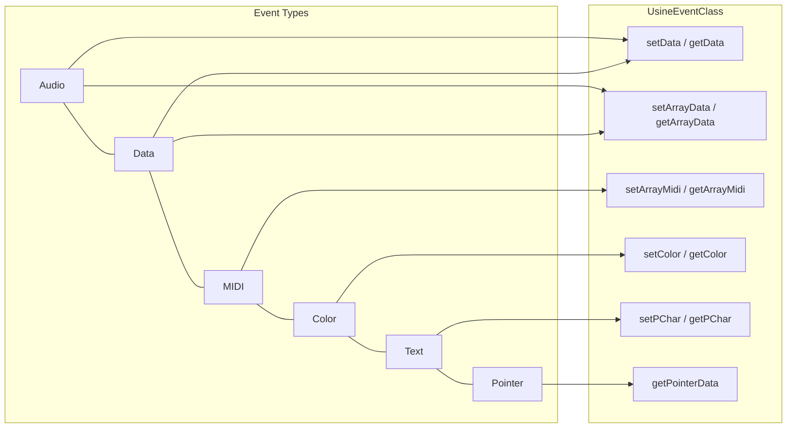
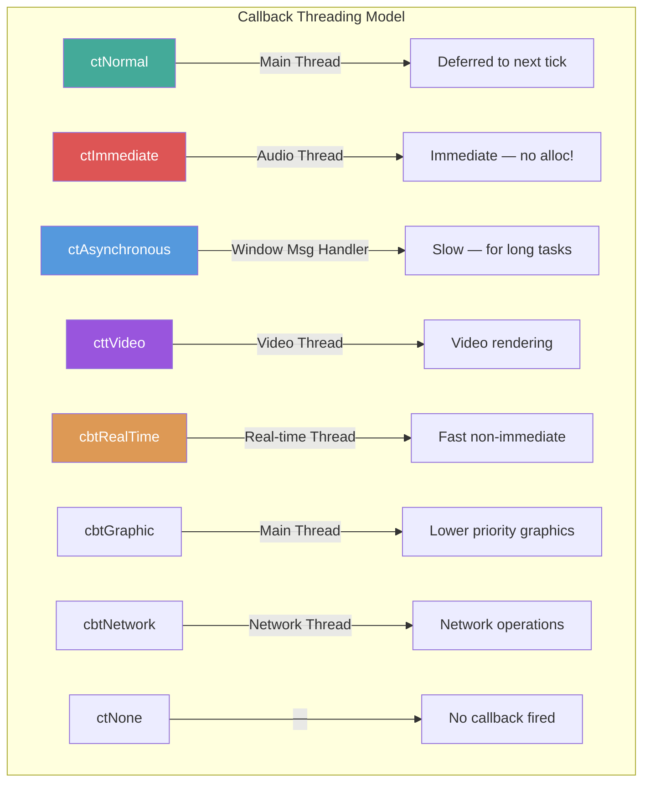
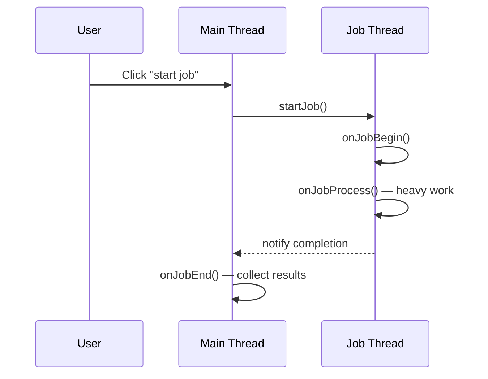
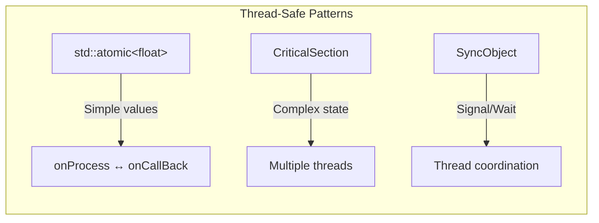

# Module Architecture

#sdk #architecture #lifecycle #callbacks #events #audio #threading

## Overview

A Usine user module is a C++ dynamic library (DLL/dylib) that Usine loads at runtime. Each module inherits from [[sdk/user-module-base|UserModuleBase]] and communicates with Usine through a well-defined callback system.

## Module Types

| Type | Constant | Description | Examples |
|------|----------|-------------|----------|
| Simple | `mtSimple` | Data, audio, or MIDI processing (no canvas) | [[examples/audio-volume|AudioVolume]], [[examples/reverb|Reverb]] |
| Control | `mtControl` | Module with a visual canvas for custom drawing | [[examples/draw-box|DrawBox]], [[examples/granulator|Granulator]] |
| Video | `mtVideo` | Video frame processing module | [[examples/video-dimmer|VideoDimmer]] |
| Device Audio | `mtDeviceAudio` | Audio device driver | — |
| Device MIDI | `mtDeviceMidi` | MIDI device driver | — |
| Device DMX | `mtDeviceDMX` | DMX lighting device | — |
| Device Laser | `mtDeviceLaser` | ILDA laser device | — |
| Device Other | `mtDeviceOther` | Other device types | — |
| Plugin Wrapper | `mtPluginWrapper` | VST/AU plugin wrapper | — |
| Other | `mtOther` | Other module types | — |

See [[sdk/data-types|Data Types]] for the full `TModuleType` enum.

## Module Lifecycle



## Three Mandatory Global Functions

Every module DLL must export exactly three functions:

### CreateModule
```cpp
void CreateModule(void*& pModule, AnsiCharPtr optionalString,
                  LongBool Flag, TMasterInfo* pMasterInfo,
                  AnsiCharPtr optionalContent);
```
Called by Usine to instantiate your module. Allocate your module class with `new` and assign to `pModule`.

### DestroyModule
```cpp
void DestroyModule(void* pModule);
```
Called by Usine to destroy the module. Cast back to your class and `delete` it.

### GetBrowserInfo
```cpp
void GetBrowserInfo(TModuleInfo* pModuleInfo);
```
Called by Usine to populate the module browser. Set at minimum `Name` and `Description`.

See [[getting-started|Getting Started]] for a complete minimal implementation.

## Data Flow: The Event System

All data in Usine flows through **events** ([[sdk/usine-event-class|UsineEventClass]]). An event is essentially a typed array of `float` values that can represent:



- **Audio data** — samples in a block (size = block size)
- **Data values** — single floats or arrays
- **MIDI codes** — packed [[sdk/data-types|TUsineMidiCode]] messages
- **Colors** — ARGB color values ([[sdk/data-types|TUsineColor]])
- **Text** — string data
- **Pointers** — raw typed pointer data (see [[examples/usine-pointers|UsinePointers]])

### Event Binding

Parameters are bound to events in `onGetParamInfo()` using `setEventClass()`:

```cpp
UsineEventClass myInput;
UsineEventClass myOutput;

void onGetParamInfo(int ParamIndex, TParamInfo* pParamInfo) override
{
    if (ParamIndex == 0)
    {
        pParamInfo->Caption = "input";
        pParamInfo->IsInput = TRUE;
        pParamInfo->setEventClass(myInput);  // bind event
    }
    // ...
}
```

Once bound, Usine automatically populates input events and reads output events.

## Callback System

### Message Structure

Callbacks receive a [[sdk/data-types|TUsineMessage]] with:
- `message` — always `MSG_CHANGE` for parameter changes
- `wParam` — the `CallBackId` you assigned in `onGetParamInfo()`
- `lParam` — message type (`MSG_CHANGE`, `MSG_CLICK`, `MSG_DBLCLICK`, etc.)

### Callback Types



| Type | Constant | Thread | When |
|------|----------|--------|------|
| Normal | `ctNormal` | Main thread | Deferred to next tick |
| Immediate | `ctImmediate` | Audio thread | Immediately on change |
| Asynchronous | `ctAsynchronous` | Window message handler | For long processes or modal windows |
| Video | `cttVideo` | Video thread | Video rendering thread |
| Real-time | `cbtRealTime` | Real-time thread | Fast but not immediate |
| Graphic | `cbtGraphic` | Main thread (slower) | Lower priority graphic updates |
| Network | `cbtNetwork` | Network thread | Dedicated network operations |
| None | `ctNone` | — | No callback fired |

> **Warning:** `ctImmediate` callbacks run on the audio thread. Never allocate memory or perform blocking operations in immediate callbacks.

## Audio Processing

The `onProcess()` callback is called on the audio thread at each block:

```cpp
void onProcess() override
{
    // Process audio - called every block (e.g., 256 samples)
    outputAudio.copyfrom(inputAudio);
    outputAudio.mult(gainCoefficient);
}
```

**Rules for `onProcess()`:**
- No memory allocation (`new`, `malloc`, `std::vector::push_back`)
- No blocking operations (locks, file I/O, network)
- No Usine SDK calls that aren't marked as real-time safe
- Keep processing as fast as possible

Set `DontProcess = TRUE` in `onGetModuleInfo()` if your module doesn't need audio processing.

**Examples:** [[examples/audio-volume|AudioVolume]], [[examples/reverb|Reverb]], [[examples/ring-mod|RingMod]], [[examples/granulator|Granulator]]

## Multi-Channel Audio

Modules can support variable channel counts using the **audio query system** (see [[sdk/sdk-functions|sdkGetAudioQueryTitle]]):

```cpp
void onGetModuleInfo(TMasterInfo* pMasterInfo, TModuleInfo* pModuleInfo) override
{
    pModuleInfo->QueryListString = sdkGetAudioQueryTitle();
    pModuleInfo->QueryListValues = sdkGetAudioQueryChannelList();
    pModuleInfo->QueryListDefaultIdx = 1;
}

int onGetNumberOfParams(int QIdx1, int QIdx2) override
{
    numChannels = sdkGetAudioQueryToNbChannels(QIdx1);
    return numChannels * 2 + extraParams;  // inputs + outputs + controls
}
```

**Examples:** [[examples/audio-volume|AudioVolume]], [[examples/ring-mod|RingMod]], [[examples/reverb|Reverb]], [[examples/granulator|Granulator]]

## Background Jobs

For long-running tasks that can't run in `onProcess()`:



```cpp
void onCallBack(TUsineMessage* Message) override
{
    if (/* user clicked start */)
        startJob();  // launches background thread
}

void onJobBegin() override { /* setup */ }
void onJobProcess() override { /* heavy computation here */ }
void onJobEnd() override { /* collect results, update UI */ }
```

`onJobBegin` and `onJobProcess` run on a background thread. `onJobEnd` runs on the main thread.

**Example:** [[examples/background-job|BackgroundJob]]

## Chunk System (Persistence)

For saving/loading custom module state beyond parameter values:

```cpp
int onGetChunkLen(LongBool Preset) override
{
    return sizeof(MyData);
}

void onGetChunk(void* chunk, LongBool Preset) override
{
    memcpy(chunk, &myData, sizeof(MyData));
}

void onSetChunk(const void* chunk, int sizeInBytes, LongBool Preset) override
{
    memcpy(&myData, chunk, sizeInBytes);
}
```

**Examples:** [[examples/draw-trajectory-box|DrawTrajectoryBox]], [[examples/simple-pad|SimplePad]], [[examples/usine-chunks|UsineChunks]]

## Settings Panel

Add persistent settings via the Settings Panel (see [[sdk/data-types|Settings Tab Constants]]):

```cpp
void onCreateSettings() override
{
    sdkAddSettingLineColor(DESIGN_TAB_NAME, &myColor, "Color", TRUE);
    sdkAddSettingLineBoolean(DESIGN_TAB_NAME, &showGrid, "Show Grid", TRUE);
    sdkAddSettingLineInteger(DESIGN_TAB_NAME, &gridSize, "Grid Size",
                            1, 100, scLinear, "", 10, TRUE);
}

void onSettingsHasChanged() override
{
    sdkRepaintPanel();
}
```

**Examples:** [[examples/data-oscilloscope|DataOscilloscope]], [[examples/draw-box|DrawBox]], [[examples/simple-pad|SimplePad]]

## Custom Drawing (mtControl)

Modules of type `mtControl` can draw on a canvas using the [[sdk/user-module-base|drawing utility methods]]:

```cpp
void onPaint() override
{
    TRectF rect = {0.1f, 0.1f, 0.9f, 0.9f};
    sdkFillRect(rect, myColor, 2.0f, clBlack, 0.0f);
    sdkFillText(rect, "Hello", clWhite, 14.0f, FALSE, FALSE, taCenter, taCenter);
}

void onMouseDown(TMouseButton Button, TShiftState Shift, float X, float Y) override
{
    // Handle mouse click at normalized coordinates (0-1)
}
```

**Examples:** [[examples/draw-box|DrawBox]], [[examples/draw-trajectory-box|DrawTrajectoryBox]], [[examples/data-oscilloscope|DataOscilloscope]], [[examples/simple-pad|SimplePad]]

## Thread Safety



- Use `std::atomic<>` for values shared between `onProcess()` and `onCallBack()` — see [[examples/audio-volume|AudioVolume]]
- Use `sdkCriticalSectionCreate/Lock/UnLock` for complex shared state — see [[examples/multithreading|MultiThreading]]
- Use `sdkSyncObjectCreate/Set/Wait` for thread synchronization — see [[examples/ring-mod-multithread|RingModMultithread]]
- Never lock in `onProcess()` if it can be avoided

## Related Pages

- [[sdk/user-module-base|UserModuleBase Class]] — Complete callback reference
- [[sdk/usine-event-class|UsineEventClass]] — Event manipulation API
- [[sdk/data-types|Data Types & Constants]] — All SDK types
- [[sdk/sdk-functions|SDK Functions]] — Utility function reference
- [[sdk/utility-functions|Utility Functions]] — Color, geometry, math helpers
- [[getting-started|Getting Started]] — Your first module
- [[docs/writing-user-modules-windows|Windows Setup]] — Visual Studio configuration
- [[docs/writing-user-modules-macos|macOS Setup]] — Xcode configuration
